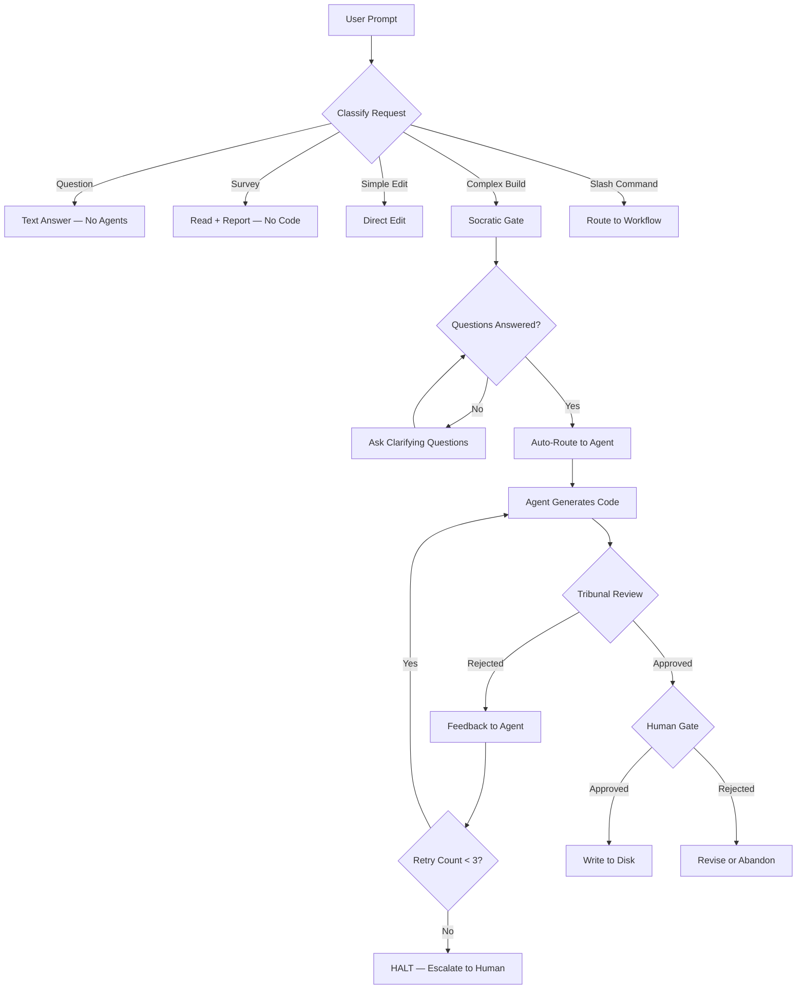

# 🏛️ Tribunal Anti-Hallucination Kit — Architecture

Works natively in **Cursor**, **Windsurf**, **Antigravity**, and any AI IDE that indexes `.agent/` folders.

---

## System Flow



---

## Slash Commands (Workflows)

Type any of these in your AI IDE chat:

| Command                 | Purpose                                                                                | File                                |
| ----------------------- | -------------------------------------------------------------------------------------- | ----------------------------------- |
| `/generate`             | Full Tribunal: Maker → Parallel Review → Human Gate                                    | `workflows/generate.md`             |
| `/review`               | Audit existing code (no generation)                                                    | `workflows/review.md`               |
| `/tribunal-full`        | ALL 19 reviewers at once — maximum coverage                                            | `workflows/tribunal-full.md`        |
| `/tribunal-backend`     | Logic + Security + Deps + Types                                                        | `workflows/tribunal-backend.md`     |
| `/tribunal-frontend`    | Logic + Security + Frontend + Types                                                    | `workflows/tribunal-frontend.md`    |
| `/tribunal-database`    | Logic + Security + SQL                                                                 | `workflows/tribunal-database.md`    |
| `/tribunal-mobile`      | Logic + Security + Mobile                                                              | `workflows/tribunal-mobile.md`      |
| `/tribunal-performance` | Logic + Performance                                                                    | `workflows/tribunal-performance.md` |
| `/brainstorm`           | Exploration mode — no code, just options                                               | `workflows/brainstorm.md`           |
| `/create`               | Structured app creation (4-stage)                                                      | `workflows/create.md`               |
| `/enhance`              | Add/update features in existing apps                                                   | `workflows/enhance.md`              |
| `/debug`                | Systematic debugging with root cause analysis                                          | `workflows/debug.md`                |
| `/plan`                 | Project planning only — no code                                                        | `workflows/plan.md`                 |
| `/deploy`               | Pre-flight checks + deployment                                                         | `workflows/deploy.md`               |
| `/test`                 | Test generation and execution                                                          | `workflows/test.md`                 |
| `/preview`              | Start/stop local dev server                                                            | `workflows/preview.md`              |
| `/status`               | Agent and project status board                                                         | `workflows/status.md`               |
| `/session`              | Multi-session state tracking                                                           | `workflows/session.md`              |
| `/orchestrate`          | Multi-agent coordination                                                               | `workflows/orchestrate.md`          |
| `/swarm`                | Supervisor → specialist Workers → unified synthesis                                    | `workflows/swarm.md`                |
| `/strengthen-skills`    | Audit and harden all skills — appends Tribunal guardrails to any SKILL.md missing them | `workflows/strengthen-skills.md`    |
| `/ui-ux-pro-max`        | Plan and implement cutting-edge UI/UX                                                  | `workflows/ui-ux-pro-max.md`        |
| `/refactor`             | Dependency-safe code refactoring                                                       | `workflows/refactor.md`             |
| `/migrate`              | Framework upgrades, DB migrations                                                      | `workflows/migrate.md`              |
| `/audit`                | Full project health audit                                                              | `workflows/audit.md`                |
| `/fix`                  | Auto-fix lint, formatting, imports                                                     | `workflows/fix.md`                  |
| `/changelog`            | Generate changelog from git history                                                    | `workflows/changelog.md`            |
| `/review-ai`            | AI/LLM integration audit                                                               | `workflows/review-ai.md`            |

---

## The 19 Tribunal Agents

| Agent                    | File                               | Activates When                                                                      |
| ------------------------ | ---------------------------------- | ----------------------------------------------------------------------------------- |
| `logic-reviewer`         | `agents/logic-reviewer.md`         | All sessions (always on)                                                            |
| `security-auditor`       | `agents/security-auditor.md`       | All sessions (always on)                                                            |
| `performance-reviewer`   | `agents/performance-reviewer.md`   | "optimize", "slow", `/tribunal-full`                                                |
| `dependency-reviewer`    | `agents/dependency-reviewer.md`    | "api", "backend", `/tribunal-full`                                                  |
| `type-safety-reviewer`   | `agents/type-safety-reviewer.md`   | "typescript", "api", `/tribunal-full`                                               |
| `sql-reviewer`           | `agents/sql-reviewer.md`           | "query", "database", `/tribunal-full`                                               |
| `frontend-reviewer`      | `agents/frontend-reviewer.md`      | "react", "hook", "component", `/tribunal-full`                                      |
| `test-coverage-reviewer` | `agents/test-coverage-reviewer.md` | "test", "spec", "coverage", `/tribunal-full`                                        |
| `mobile-reviewer`        | `agents/mobile-reviewer.md`        | "mobile", "react native", "flutter", `/tribunal-full`                               |
| `ai-code-reviewer`       | `agents/ai-code-reviewer.md`       | "llm", "openai", "anthropic", "ai", `/tribunal-full`, `/review-ai`                  |
| `accessibility-reviewer` | `agents/accessibility-reviewer.md` | "a11y", "wcag", "aria", `/tribunal-frontend`, `/tribunal-full`                      |
| `resilience-reviewer`    | `agents/resilience-reviewer.md`    | "retry", "circuit breaker", "error boundary", `/tribunal-backend`, `/tribunal-full` |
| `schema-reviewer`        | `agents/schema-reviewer.md`        | "validation", "zod", "pydantic", `/tribunal-backend`, `/tribunal-full`              |
| `precedence-reviewer`    | `agents/precedence-reviewer.md`    | All sessions — checks Case Law before generation                                    |
| `penetration-tester`     | `agents/penetration-tester.md`     | "pentest", "red team", "attack surface", `/tribunal-full`                           |
| `ui-ux-auditor`          | `agents/ui-ux-auditor.md`          | "component", "ui", "design", "landing", `/tribunal-frontend`, `/tribunal-full`      |
| `vitals-reviewer`        | `agents/vitals-reviewer.md`        | Frontend CWV depth, `/tribunal-speed`, `/tribunal-full`                             |
| `throughput-optimizer`   | `agents/throughput-optimizer.md`   | Server runtime, event-loop, `/tribunal-speed`, `/tribunal-full`                     |
| `db-latency-auditor`     | `agents/db-latency-auditor.md`     | "slow query", "index", "N+1", `/tribunal-speed`, `/tribunal-full`                   |

---

## Swarm / Supervisor Architecture

The Swarm system decomposes complex multi-domain goals into independent sub-tasks dispatched to specialist Workers.

```
/swarm [complex multi-domain goal]
        │
        ▽
  supervisor-agent (triage)
  └─ reads: swarm-worker-registry.md
  └─ emits: WorkerRequest JSON per sub-task
        │
        ├───── WorkerRequest ───→ Worker A (e.g. backend-specialist)
        ├───── WorkerRequest ───→ Worker B (e.g. database-architect)
        └───── WorkerRequest ───→ Worker C (e.g. documentation-writer)
                                    │
                          WorkerResult (success/failure/escalate)
                                    │
                         supervisor-agent (synthesize)
                                    │
                         ━━━ Swarm Complete ━━━
                         Human Gate → Y / N / R
```

**Key files:**

| File                               | Role                                                           |
| ---------------------------------- | -------------------------------------------------------------- |
| `agents/supervisor-agent.md`       | Triage, dispatch, retry, synthesis logic                       |
| `agents/swarm-worker-contracts.md` | WorkerRequest + WorkerResult JSON schemas                      |
| `agents/swarm-worker-registry.md`  | Maps task types and keywords to specialist agents              |
| `workflows/swarm.md`               | `/swarm` slash command procedure                               |
| `scripts/swarm_dispatcher.js`      | Validates WorkerRequest/WorkerResult JSON (use `--mode swarm`) |

**Constraints:**

- Maximum 5 Workers per swarm invocation
- Workers are independent — no Worker depends on another's pending result
- Failed workers are retried up to 3 times with targeted feedback
- Workers that fail after 3 retries are escalated, not silently dropped
- Human Gate is never skipped

---

## Specialist Agents

| Agent / Expert              | Domain                                          |
| --------------------------- | ----------------------------------------------- |
| `supervisor-agent`          | Swarm triage, Worker dispatch, result synthesis |
| `orchestrator`              | Multi-agent coordination                        |
| `agent-organizer`           | Specialist agent operations                     |
| `project-planner`           | 4-phase structured planning                     |
| `backend-specialist`        | API, server, auth                               |
| `dotnet-core-expert`        | C# / .NET architecture                          |
| `python-pro`                | Python backend development                      |
| `frontend-specialist`       | Web UI / Components                             |
| `react-specialist`          | React / Next.js architecture                    |
| `vue-expert`                | Vue / Nuxt applications                         |
| `database-architect`        | Schema, migrations                              |
| `sql-pro`                   | Complex queries, optimization                   |
| `mobile-developer`          | React Native, Flutter                           |
| `devops-engineer`           | CI/CD, Docker, deployment                       |
| `platform-engineer`         | Infrastructure, cloud native                    |
| `devops-incident-responder` | Production issues                               |
| `debugger`                  | Systematic debugging                            |
| `game-developer`            | Game development                                |
| `security-auditor`          | Penetration testing, OWASP                      |
| `penetration-tester`        | Red team tactics                                |
| `performance-optimizer`     | Profiling, optimization                         |
| `code-archaeologist`        | Legacy code analysis                            |
| `explorer-agent`            | Unknown codebase mapping                        |
| `documentation-writer`      | Docs, READMEs, API docs                         |
| `test-engineer`             | Test design and strategy                        |
| `qa-automation-engineer`    | Test automation                                 |
| `seo-specialist`            | SEO auditing                                    |
| `product-manager`           | Feature prioritization                          |
| `product-owner`             | Requirements, scope                             |

---

## How the Tribunal Works

```
User prompt
    │
    ▼
GEMINI.md → Classify request → Select active reviewers
    │
    ▼
MAKER generates code (context-bound, no hallucinations)
    │
    ▼
ALL SELECTED REVIEWERS run in parallel
    │
    ├── Logic      → hallucinated methods?
    ├── Security   → OWASP violations?
    ├── Deps       → fake npm packages?
    ├── Types      → any/unsafe casts?
    ├── SQL        → injection / N+1?
    ├── Frontend   → hooks violations?
    ├── Perf       → O(n²) / blocking I/O?
    └── Tests      → tautology / no edges?
    │
    ▼
VERDICT: All approved → HUMAN GATE (you approve or reject the diff)
         Any failed   → Feedback returned to Maker for revision (max 3 attempts)
         3 failures   → HALT and escalate to human
```

---

## Auto Domain Routing (GEMINI.md)

| Keywords in prompt           | Extra reviewers added     |
| ---------------------------- | ------------------------- |
| api, route, endpoint, server | + Dependency + TypeSafety |
| sql, query, database, orm    | + SQL                     |
| component, hook, react, next | + Frontend + TypeSafety   |
| test, spec, coverage, jest   | + TestCoverage            |
| optimize, slow, memory, cpu  | + Performance             |

---

## Script Inventory

All scripts live in `.agent/scripts/`:

| Script                     | Purpose                                                                           | Usage                                                         |
| -------------------------- | --------------------------------------------------------------------------------- | ------------------------------------------------------------- |
| `checklist.js`             | Priority-ordered project audit                                                    | `node .agent/scripts/checklist.js .`                          |
| `verify_all.js`            | Full pre-deploy validation                                                        | `node .agent/scripts/verify_all.js`                           |
| `auto_preview.py`          | Local dev server management                                                       | `python .agent/scripts/auto_preview.py start`                 |
| `session_manager.js`       | Multi-session state tracking                                                      | `node .agent/scripts/session_manager.js status`               |
| `lint_runner.py`           | Standalone lint runner                                                            | `python .agent/scripts/lint_runner.py . --fix`                |
| `test_runner.py`           | Auto-detecting test runner                                                        | `python .agent/scripts/test_runner.py . --coverage`           |
| `security_scan.js`         | OWASP-aware source code scanner                                                   | `node .agent/scripts/security_scan.js .`                      |
| `dependency_analyzer.py`   | Unused/phantom dep checker                                                        | `python .agent/scripts/dependency_analyzer.py . --audit`      |
| `schema_validator.py`      | DB schema validator                                                               | `python .agent/scripts/schema_validator.py .`                 |
| `bundle_analyzer.py`       | JS/TS bundle size analyzer                                                        | `python .agent/scripts/bundle_analyzer.py . --build`          |
| `strengthen_skills.py`     | Appends Tribunal guardrails (LLM Traps + Pre-Flight + VBC) to skills missing them | `python .agent/scripts/strengthen_skills.py . --dry-run`      |
| `swarm_dispatcher.js`      | Validate Orchestrator micro-worker JSON payloads                                  | `node .agent/scripts/swarm_dispatcher.js --file payload.json` |
| `skill_integrator.py`      | Map active skills to executable scripts                                           | `python .agent/scripts/skill_integrator.py`                   |
| `test_swarm_dispatcher.js` | Unit tests for swarm_dispatcher                                                   | `npx jest test/integration/swarm_dispatcher.test.js`          |

---

## Error Recovery

```
Attempt 1  → Run with original parameters
Attempt 2  → Run with feedback from failure
Attempt 3  → Run with maximum constraints
Attempt 4  → HALT — escalate to human with full failure history
```

Script failures follow cascade rules:

- Security failure → **HALT** all steps
- Lint failure → continue, flag as deploy-blocker
- Test failure → continue analysis, mark incomplete
- Non-critical failure → log and continue

---

## Directory Structure

```
.agent/
├── ARCHITECTURE.md          ← This file
├── GEMINI.md                ← Root behavior config (includes /swarm routing)
├── agents/                  ← 43 specialist + reviewer agents (19 reviewers + 24 domain)
│   ├── supervisor-agent.md  ← Swarm triage, dispatch, synthesis
│   ├── swarm-worker-contracts.md  ← WorkerRequest/WorkerResult schemas
│   └── swarm-worker-registry.md   ← Task type → agent routing map
├── rules/GEMINI.md          ← Master rules (P0 priority)
├── scripts/                 ← 28 Python/JS automation scripts
├── skills/                  ← 106 modular skill packages (all hardened)
├── patterns/                ← 5 ADK skill base patterns
├── history/                 ← Case Law + Skill Evolution data (user-generated, preserved on update)
└── workflows/               ← 34 slash command definitions
    └── swarm.md             ← /swarm orchestration procedure
```
