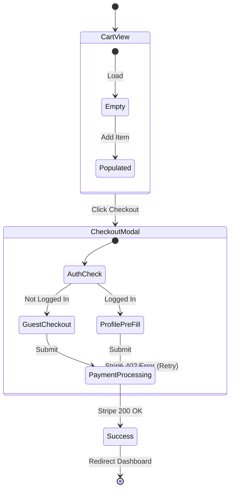

## Hallucination Traps (Read First)

- ❌ Drawing wireframes without defined user personas -> ✅ Establish WHO uses each screen before designing
- ❌ Skipping error/empty/loading states in flow diagrams -> ✅ Every screen needs 4 states: loading, empty, populated, error
- ❌ Assuming linear user journeys -> ✅ Real users jump between screens, go back, and abandon flows mid-way

---

# Appflow & Wireframing — Visualization Mastery

---

## 1. The Mermaid Appflow Protocol

When asked to "design the flow", do not write prose. Write deterministic Mermaid diagrams that map state interactions.

### Example: E-Commerce Checkout Flow



---

## 2. Low-Fidelity Wireframe Notation

When asked to define the UI layout conceptually before building Shadcn/Tailwind components, use structural ASCII/Markdown notation to establish layout boundaries.

```text
[ HEADER: Logo (Left) | Search Bar (Center, expanding) | User Avatar (Right) ]
-------------------------------------------------------------------------
[ SIDEBAR (Sticky, W-64) ] |  [ HERO SECTION: H1 Hook | CTA Button Primary ]
- Dashboard                |  [ .......................................... ]
- Analytics                |  [ FEATURE GRID (CSS Grid columns-3)        ]
- Settings                 |  [ [Card 1]     [Card 2]      [Card 3]      ]
[........................] |  [..........................................]
```

**Why do this?**
Because moving an ASCII box takes 3 seconds. Rewriting 4 nested div flexbox tails takes 5 minutes. Secure the approval on the wireframe before touching code.

---

## 3. The Empty State / Loading State Mandate

When mapping application flows, AI frequently charts the "Happy Path" (User logs in -> User sees 10 items).

Every single screen designed in an App Flow MUST explicitly define:

1. **The Loading State:** What does the user see while the network executes? (Skeleton loaders vs Spinners).
2. **The Empty State:** What does the UI look like on Day 1 when the user has zero data? (An empty white screen is an instant bounce-rate death sentence; use an Empty State CTA).

---

## 4. Interaction Matrices (Event Mapping)

Before writing React, chart exactly what the user can do on the screen and what the system does in response.

| Interaction         | Trigger                | System Response Hook         | Edge Case                      |
| :------------------ | :--------------------- | :--------------------------- | :----------------------------- |
| Click `Add to Cart` | `onClick`              | Dispatch `Zustand.add(item)` | If out of stock, render Toast  |
| Scroll to Bottom    | `IntersectionObserver` | `fetchNextPage()`            | Reached max items, show footer |
| Click outside Modal | `useClickAway`         | `setIsOpen(false)`           | Prevent close if form is dirty |

---

---

AI coding assistants often fall into specific bad habits when dealing with this domain. These are strictly forbidden:

1. **Over-engineering:** Proposing complex abstractions or distributed systems when a simpler approach suffices.
2. **Hallucinated Libraries/Methods:** Using non-existent methods or packages. Always `// VERIFY` or check `package.json` / `requirements.txt`.
3. **Skipping Edge Cases:** Writing the "happy path" and ignoring error handling, timeouts, or data validation.
4. **Context Amnesia:** Forgetting the user's constraints and offering generic advice instead of tailored solutions.
5. **Silent Degradation:** Catching and suppressing errors without logging or re-raising.

---

**Slash command: `/review` or `/tribunal-full`**
**Active reviewers: `logic-reviewer` · `security-auditor`**

### ❌ Forbidden AI Tropes

1. **Blind Assumptions:** Never make an assumption without documenting it clearly with `// VERIFY: [reason]`.
2. **Silent Degradation:** Catching and suppressing errors without logging or handling.
3. **Context Amnesia:** Forgetting the user's constraints and offering generic advice instead of tailored solutions.

Review these questions before confirming output:

```
✅ Did I rely ONLY on real, verified tools and methods?
✅ Is this solution appropriately scoped to the user's constraints?
✅ Did I handle potential failure modes and edge cases?
✅ Have I avoided generic boilerplate that doesn't add value?
```

### 🛑 Verification-Before-Completion (VBC) Protocol

**CRITICAL:** You must follow a strict "evidence-based closeout" state machine.

- ❌ **Forbidden:** Declaring a task complete because the output "looks correct."
- ✅ **Required:** You are explicitly forbidden from finalizing any task without providing **concrete evidence** (terminal output, passing tests, compile success, or equivalent proof) that your output works as intended.

## Pre-Flight Checklist

- [ ] Have I reviewed the user's specific constraints and requests?
- [ ] Have I checked the environment for relevant existing implementations?

## VBC Protocol (Verification-Before-Completion)

You MUST verify existing code signatures and variables before attempting to modify or call them. No hallucination is permitted.

---

## 🤖 LLM-Specific Traps

AI coding assistants often fall into specific bad habits when dealing with this domain. These are strictly forbidden:

1. **Over-engineering:** Proposing complex abstractions or distributed systems when a simpler approach suffices.
2. **Hallucinated Libraries/Methods:** Using non-existent methods or packages. Always `// VERIFY` or check `package.json` / `requirements.txt`.
3. **Skipping Edge Cases:** Writing the "happy path" and ignoring error handling, timeouts, or data validation.
4. **Context Amnesia:** Forgetting the user's constraints and offering generic advice instead of tailored solutions.
5. **Silent Degradation:** Catching and suppressing errors without logging or re-raising.

---

## 🏛️ Tribunal Integration (Anti-Hallucination)

**Slash command: `/review` or `/tribunal-full`**
**Active reviewers: `logic-reviewer` · `security-auditor`**

### ❌ Forbidden AI Tropes

1. **Blind Assumptions:** Never make an assumption without documenting it clearly with `// VERIFY: [reason]`.
2. **Silent Degradation:** Catching and suppressing errors without logging or handling.
3. **Context Amnesia:** Forgetting the user's constraints and offering generic advice instead of tailored solutions.

### ✅ Pre-Flight Self-Audit

Review these questions before confirming output:

```
✅ Did I rely ONLY on real, verified tools and methods?
✅ Is this solution appropriately scoped to the user's constraints?
✅ Did I handle potential failure modes and edge cases?
✅ Have I avoided generic boilerplate that doesn't add value?
```

### 🛑 Verification-Before-Completion (VBC) Protocol

**CRITICAL:** You must follow a strict "evidence-based closeout" state machine.

- ❌ **Forbidden:** Declaring a task complete because the output "looks correct."
- ✅ **Required:** You are explicitly forbidden from finalizing any task without providing **concrete evidence** (terminal output, passing tests, compile success, or equivalent proof) that your output works as intended.
